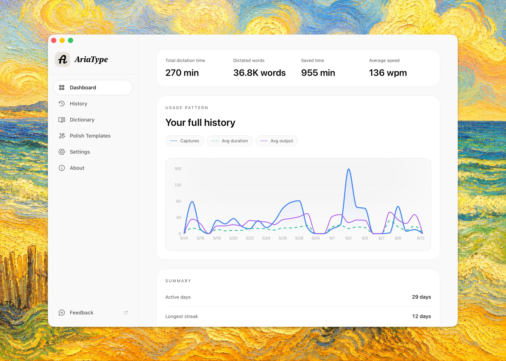

  

  <h1>AriaType</h1>

  <h3>Voice-driven writing, input, and cross-app work for your desktop.</h3>

  

    AriaType is the voice layer for your desktop, turning spoken thoughts into context-aware work right where your cursor is.
  

  

    Reply, take notes, draft prompts, and clean up documents without leaving the app you are already using.
  

  

    <a href="https://github.com/joe223/AriaType/releases">Download</a>
    ·
    <a href="https://ariatype.com">Website</a>
    ·
    <a href="context/README.md">Docs</a>
    ·
    <a href="https://github.com/joe223/AriaType/discussions">Discussions</a>
  

  

    
    
    
    
    
    
  

  

---

## Starting With Writing

When a thought is ready, you should be able to speak it into the work in front of you.

AriaType starts with the writing you do all day: replies, notes, prompts, rough ideas, and text that needs to land in the app you are already using.

It does not only listen to what you said. It also cares where you are writing, where the text should land, and how people actually speak.

## Highlights

- 🔊 **Noise reduction / 降噪**: Filter everyday background noise for more stable voice input. 过滤日常环境噪声，让语音输入更稳定。
- 🤫 **VAD voice activity detection / VAD 语音活动检测**: Detect speech, pauses, and silence with less manual control. 自动识别说话、停顿与静音，减少手动控制。
- 🧠 **Context awareness / 上下文感知**: Use the current window to better match the app, field, and task. 理解当前窗口、输入位置与任务语境，使输出更贴合使用场景。
- ✍️ **Local and cloud AI polish / 本地和云端 AI 润色**: Remove fillers, fix punctuation, tighten wording, and choose between local models or your own cloud provider. 去除口头冗余，校正标点，收束表达；可在本地模型与自有云端服务之间自由选择。
- 🧩 **Polish templates / 润色模板**: Use built-in or custom templates for chat replies, formal writing, concise notes, documents, and agent prompts. 内置聊天回复、正式写作、简洁笔记、文档整理、Agent Prompt 等模板，并支持按场景自定义。
- 📚 **Word Correction Memory / 词级纠错记忆**: Best-effort learning captures stable word and phrase replacements from your edits, then reuses repeated corrections locally before polish. 在可访问的输入框中，尽力学习稳定的词级替换；经重复确认的更正会先在本地应用，再进入润色流程。
- 🗂️ **Dictionary management / 词库管理**: Review learned terms, add custom hotwords, import CSV or alias mappings, and delete individual dictionary items when they are no longer useful. 查看自动学习词条，维护自定义热词，导入 CSV、别名或替换映射；不再适用的词条可单独删除。
- 🔤 **Conservative sound-aware hotwords / 保守音近热词**: Match explicit dictionary terms, pinyin, and aliases for product names, tools, and domain terms before AI polish runs. 围绕显式词库、拼音与别名，保守匹配产品名、工具名和领域术语；常见错听先确定性修正，再进入 AI 润色。
- ⌨️ **Shortcut workflows / 快捷键工作流**: Bind shortcuts to dictation, chat, or custom actions with hold, toggle, and double-tap trigger modes. 可将不同快捷键绑定到听写、聊天回复或自定义动作；按住说、切换录音、双击触发均可按需配置。
- ☁️ **Cloud STT and custom providers / 云端识别与自定义服务**: Stay local-first, or connect your preferred speech and language providers with model, language, and endpoint checks. 默认本地优先；需要云端能力时，可接入偏好的语音与语言服务，并校验模型、语言和接口配置。
- 🧭 **Local model management / 本地模型管理**: Download, cancel, delete, and compare local models with size, speed, accuracy, GPU, runtime readiness, and idle unload controls. 本地模型支持下载、取消、删除与对比；大小、速度、准确率、GPU、运行时状态和空闲卸载一目了然。
- ⚡ **Streaming polish option / 流式润色选项**: Advanced users can stream polish chunks directly into the target app for faster visible output. 需要更快可见反馈时，可将润色片段直接流式写入目标应用。
- 🧹 **Cleaner final text / 更干净的最终文本**: Output removes the final Chinese or English sentence period by default while preserving questions, exclamations, and other punctuation. 默认移除输出末尾多余的中英文句号，同时保留问号、感叹号等语气标点。
- 📊 **History and retry / 历史记录与重试**: Keep transcription history with raw/final text, engine details, timing, usage trends, and retry support for saved recordings. 保留识别历史、原文与最终文本、引擎信息和耗时数据；支持录音重试，也便于回看使用趋势。
- 🌏 **Multilingual / 多语言**: Support Chinese, English, Japanese, Korean, and more for daily writing. 覆盖中文、英文、日文、韩文等多语言日常写作场景。
- 🎯 **Cursor insertion / 光标处输入**: No window switching or copy-paste; text lands where you are working. 无需切换窗口，也无需复制粘贴；说完，文字即落在当前光标处。
- 🔒 **Privacy and security / 安全隐私**: Local-first by default, so everyday voice content stays on your device. 默认本地优先处理，让日常语音内容留在自己的设备上。
- 🖥️ **Desktop comfort / 桌面使用体验**: Soft start/end sounds, Light/Dark themes, hidden scrollbars, tray controls, and an adjustable Pill Window. 开始与结束提示音更柔和；主题、滚动条、托盘控制和 Pill Window 均可按使用习惯调整。

## Use It For

- **Reply faster** in chat apps, email, collaboration tools, and browser fields.
- **Capture ideas** before they disappear, without stopping to type.
- **Draft prompts and instructions** from natural spoken language.
- **Clean up rough speech** by removing fillers, fixing punctuation, and tightening wording.
- **Write across apps** with one consistent voice workflow.
- **Use the current window as context** when the output should fit the task in front of you.
- **Stay private by default** with local processing for everyday work.

## Why It Feels Different

AriaType is built for your desktop, not just a single input box.

- **Works in the current app**: text lands at the cursor instead of forcing you into another tool.
- **Matches natural speech**: pauses, silence, and everyday noise are part of the experience.
- **Fits the task in front of you**: current-window context helps the output match the app, field, and moment.
- **Lets you choose privacy and power**: use local-first defaults or connect your own services.
- **Feels complete on desktop**: themes, multilingual UI, shortcuts, and a customizable Pill Window.

## Designed Around Your Desktop

AriaType is a voice layer for the desktop, not another place you have to move your work into.

It is built around the current app, the current field, and the current cursor. Wherever you are working, that is where your voice becomes usable text.

## How It Works

1. Install AriaType.
2. Grant microphone and accessibility permissions.
3. Hold the shortcut in any app.
4. Speak naturally.
5. Release and the text appears at the cursor.

By default, `Cmd + /` starts raw dictation, and `Opt + /` inserts polished output. You can change the shortcuts in settings.

## Privacy And Permissions

AriaType asks for only the permissions needed to make desktop voice interaction work:

- 🎙️ **Microphone**: Records your speech.
- ⌨️ **Accessibility**: Inserts text into the active app.
- 🪟 **Screen/window context**: Optional, used for context awareness so output can better match the current app, field, and task.

AriaType does not require an account and does not upload your voice by default. Remote services are optional and are used only when you configure and enable them.

## Platforms

|  | Platform | Status | Requirements |
|---|---|---|---|
|  | macOS Apple Silicon | Stable | macOS 12.0+ |
|  | macOS Intel | Stable | macOS 12.0+ |
|  | Windows | In progress | Coming soon |

## Download

Download the latest version from:

- [GitHub Releases](https://github.com/joe223/AriaType/releases)
- [Official website](https://ariatype.com)

After installation, follow the system prompts to grant microphone and accessibility permissions.

## Project Status

AriaType is under active development. The macOS version is usable today, and the Windows version is in progress.

Current focus:

- More accurate speech recognition
- Better Chinese and multilingual workflows
- More reliable cross-app insertion
- More useful text polish and custom templates
- A quieter, more customizable desktop voice experience

If you want voice to become a real layer of desktop work, star the repo to follow the project and support its development.

## Contributing

Issues, discussions, product feedback, and code contributions are welcome.

Useful ways to help:

- Report recognition issues
- Share results across languages, accents, and devices
- Improve onboarding and installation flows
- Refine desktop interaction details
- Add or improve text polish templates
- Improve docs and translations

Developer documentation starts at [context/README.md](context/README.md).

## License

AriaType is licensed under [AGPL-3.0](LICENSE).
